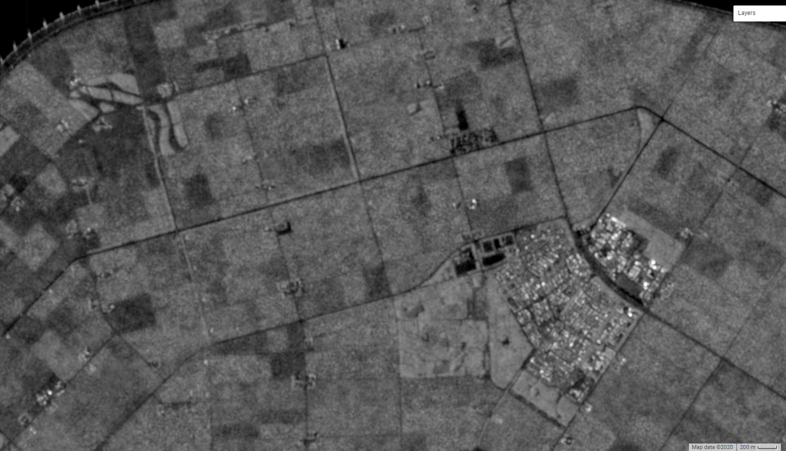

# Multitemporal-Sentinel-1-images-denoising-and-downloading-via-GEE
Multitemporal Sentinel-1 images denoising and downloading via GEE

https://code.earthengine.google.com/?scriptPath=users%2Fzhaoweiyingnla%2Fdefault%3AS1_timeSeries_image_point_sameOrbit_downloading

It allows you to download the time series noisy, denoised images, different kinds of time series over your interest point.

Since the Sentinel-1 data is save in int format in Google Earth Engine (GEE), detailed information may be lost.

1)Temporal average image:

2)Noisy image:

3)Deoised image:

