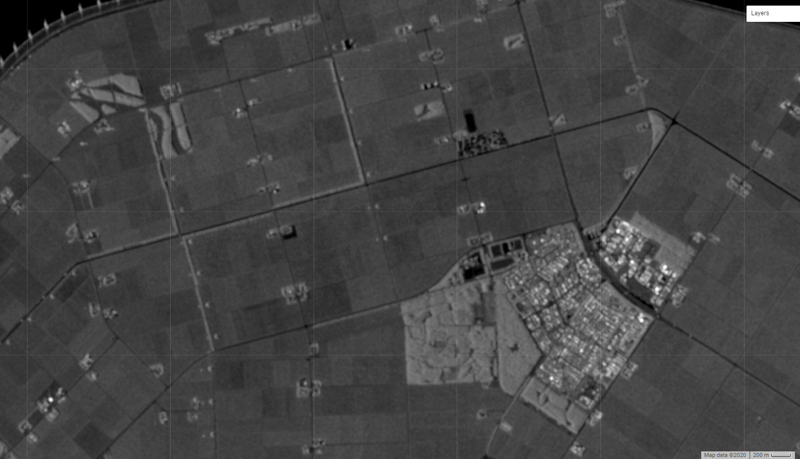

# Multitemporal-Sentinel-1-images-denoising-and-downloading-via-GEE
Multitemporal Sentinel-1 images denoising and downloading via GEE

https://code.earthengine.google.com/?scriptPath=users%2Fzhaoweiyingnla%2Fdefault%3AS1_timeSeries_image_point_sameOrbit_downloading

Since the Sentinel-1 data is save in int format in Google Earth Engine (GEE), detailed information may be lost.

